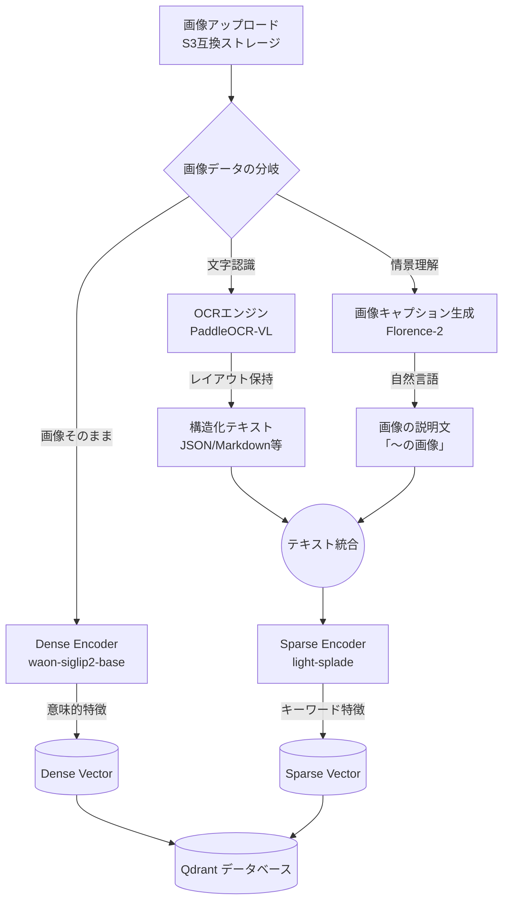
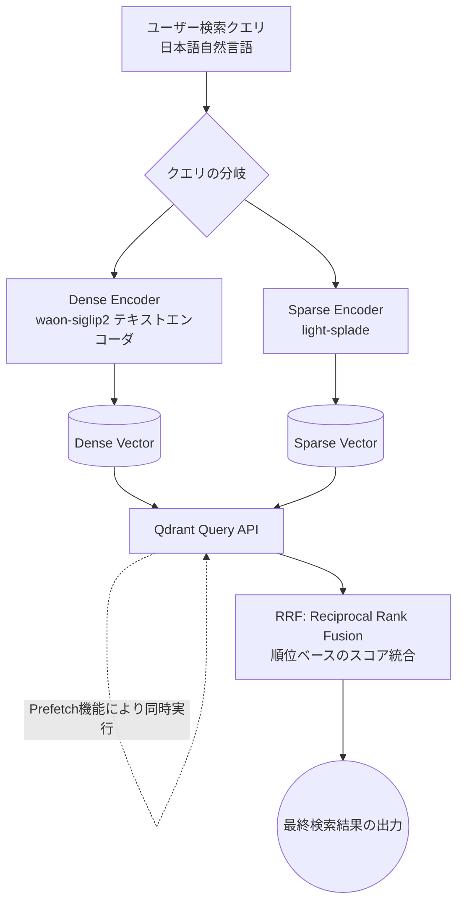

# アーキテクチャ

## 利用するモデル

Dense Encoder (llm-jp/waon-siglip2-base-patch16-256): 画像そのものを意味的な密ベクトル（Dense Vector）に変換します。WAONと呼ばれる高品質なネイティブ日本語画像テキストペアデータセットで学習されており、日本の風景や文化に対して94.97%という非常に高い分類精度（WAON-Bench）を誇るため、日本語検索の意図を正確に捉えることができます 。  

OCRエンジン (PaddleOCR-VL-0.9B): レシートやスクリーンショットからテキストを抽出します。非常に軽量（0.9Bパラメータ）でありながら日本語を含む109言語に対応しており、単なるテキストだけでなく、レイアウト情報を保持した構造化データ（JSONやMarkdownなど）として出力できる強みがあります 。  

画像キャプション生成 (Florence-2): 風景写真などテキストを含まない現実世界の画像に対し、「〜の画像」といった詳細な自然言語の説明文を生成します 。これにより、文字を含まない画像に対しても有効なSparse Vectorを生成できるようになります。  

Sparse Encoder (bizreach-inc/light-splade-japanese-28M): 抽出したテキストや生成したキャプションから、キーワードの一致を捉える疎ベクトル（Sparse Vector）を生成します。多言語対応で日本語の検索ベンチマークでも高い精度を示します。

## パイプライン

### 画像取り込み

### 画像検索

* **Dense Encoder (`llm-jp/waon-siglip2-base-patch16-256`)**
* **役割:** 画像そのものを意味的な密ベクトル（Dense Vector）に変換します。
* **特徴:** 高品質な日本語画像テキストペアデータセット「WAON」で学習されており、日本の風景や文化に対して非常に高い分類精度（WAON-Bench 94.97%）を誇ります。日本語特有のコンテキストを正確に捉えることが可能です。

* **OCRエンジン (`PaddleOCR-VL-0.9B`)**
* **役割:** レシートやスクリーンショットなどの画像からテキスト情報を抽出します。
* **特徴:** 0.9Bと軽量でありながら109言語に対応。単なるテキスト抽出にとどまらず、レイアウト情報を保持した構造化データとして出力できる点が強みです。

* **画像キャプション生成 (`Florence-2`)**
* **役割:** テキストを含まない風景写真などに対し、「〜の画像」といった詳細な自然言語の説明文を生成します。
* **特徴:** これにより、文字情報を持たない画像に対しても、後続の処理で有効なSparse Vectorを生成できるようになります。

* **Sparse Encoder (`light-splade-japanese-28M`)**
* **役割:** 抽出したテキストや生成されたキャプションから、キーワードの一致を捉える疎ベクトル（Sparse Vector）を生成します。
* **特徴:** `BGE-M3`は多言語対応で高精度ですが、推論レイテンシやリソース消費を抑えたいので、日本語特化で軽量な`light-splade-japanese`を採用します。

1. **クエリのベクトル化:** 入力された日本語の検索クエリは、取り込み時と同じモデルを使用して「Dense Vector」と「Sparse Vector」の2種類に変換されます。
2. **Prefetchによる効率的並行検索:** QdrantのQuery APIに備わっている**Prefetch機能**を利用することで、Dense Vector（意味的類似性）とSparse Vector（キーワードの厳密一致）の検索を効率的に同時実行します。
3. **RRFによるスコア統合:** DenseとSparseという尺度の異なるスコアを統合するため、Qdrantにネイティブ実装されている**RRF (Reciprocal Rank Fusion)** を使用します。各検索結果の順位の逆数を足し合わせるこの手法により、最も安定して高精度な検索結果をユーザーに返すことができます。
